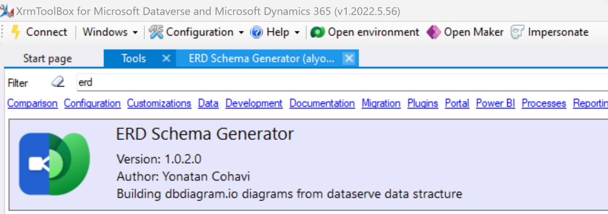
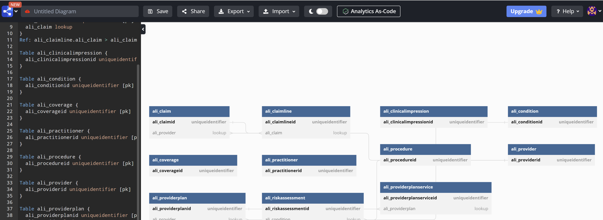
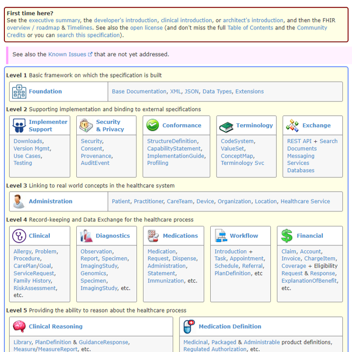
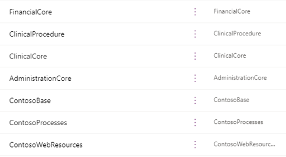

# Segmenting a Healthcare Solution following HL7 FHIR Guidelines
Organizations leverage the **Dynamics 365** and **Dataverse** platform many different ways to meet their business needs. Almost each implementation requires some degree of customization. Examples include specialized relational data models to business requirements requiring complex logic. **This post and subsequent video will cover a fictionalized observation of a healthcare solution. We'll look into tools to help conceptualize and diagram our solution.** We will then go into a common use case: **How to split our feature into logical groups allowing for specific teams to work and deploy independently.**

## The Entity Relational Diagram
The entity relational diagram helps organizations visualize the data model. I've seen these diagrams cover entire walls with hundreds of tables all interconnected with keys, lines and boxes. Sometimes these are nicely grouped but the majority of the time I see these almost as a big knot. Anyone who has worked with Christmas lights can relate here!

To help, I'll show a community tool available to help us not only show our existing data model but also help as we look to logical group the tables.

## The XrmToolBox tool: ERD Schema Generator
This tool, the [ERD Schema Generator](https://www.xrmtoolbox.com/plugins/ERDSchemaGenerator/), is a free resource that is part of the community **XrmToolBox**. It has the ability to connect to your environment, list tables and allow a user to select which tables to map. Once selected the tool will provide a schema that can then be used with an online tool called **dbdiagram.io**.

 
Above is an image of the tool. Below in the video I'll go into more detail about the tool. The steps to use the tool are straightforward. Simply connect to your environment with appropriate permissions. Next, load your tables. From there, select the tables you want to diagram. Finally, generate your schema and head to [dbdiagram.io](https://dbdiagram.io/home/) to visualize and print the diagram.

 
# Contoso Healthcare Solution Segmentation
## The HL7 FHIR Architectural Pattern
The **HL7 FHIR standard** is an agreed upon set of rules and definitions defining how the healthcare industry should establish its processes. It is split into 5 distinct levels: **Foundation, External Integrations and Implementation, Administration, Record Keeping and Reasoning**. [A link to the current version can be found here.](https://hl7.org/fhir/)

 

## The use case: Segment Contoso Healthcare's data model solution into the HL7 FHIR standard
In this scenario the team is tasked to segment the data model solution due to issues related to recent deployments. Reviewing with the architecture team, the group has agreed to align to industry standards. In this case, the **HL7 FHIR** standard.

### Common Data Model Healthcare Industry Solution
In this case, the group is extremely lucky. A well-documented example using this exact standard is available leveraging the **Common Data Model**. The group will align to these logical groupings as they share very similar traits.

### Segmenting the solutions
The team creates unmanaged solutions within their development environment to house the logical levels of the FHIR. They create [FinancialCore](https://learn.microsoft.com/en-us/common-data-model/schema/core/industrycommon/healthcare/financial/overview), an [AdministrationCore](https://learn.microsoft.com/en-us/common-data-model/schema/core/industrycommon/healthcare/administration/overview) and [ClinicalCore](https://learn.microsoft.com/en-us/common-data-model/schema/core/industrycommon/healthcare/clinical/overview) solutions. They move existing tables to these solutions and remove the table from the **ContosoCore** solution. Any business logic and resources referred to by the new core solutions will have a similar setup to **ContosoCore** solution.

 

### Deploying the new managed solutions
The team exports the new solutions, including the **ContosoCore**, **Processes** and **WebResources** as manage solutions using an automated deployment approach. The team installs the new solutions then performs an upgrade of the existing Contoso core solutions. By having the tables and business logic already represented within the new logical solutions, there is no risk to losing any customizations.

# Video and Demo
Below you'll find a video describing the approach with a demo recording to help!

Video: 

# Next Steps
Now the team has logically separated the functional areas within their own solutions. This will help with team development efforts and allow shipping of new functional features when ready.

Thank you for reading and viewing the video, if you have any questions, please reach out to myself or your Microsoft representative to learn how we can help!